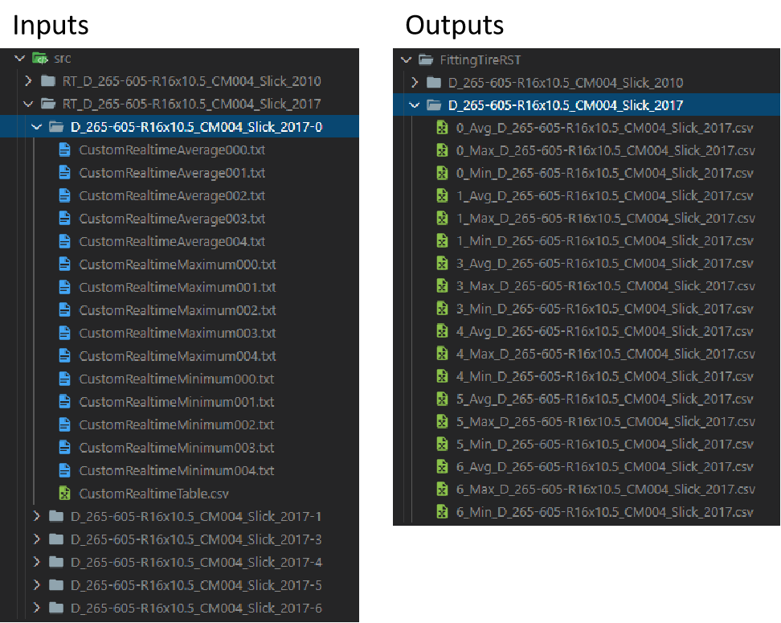
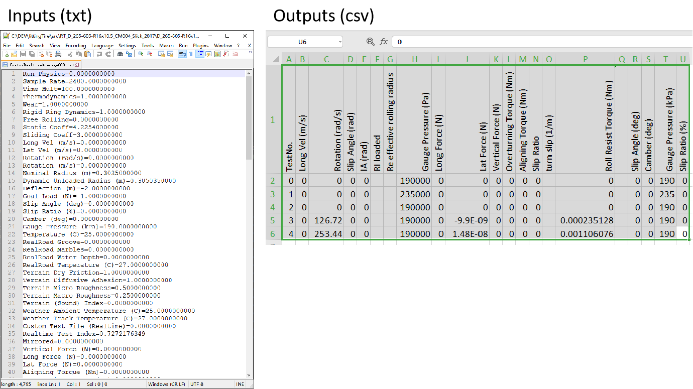

# Summarize simulation output files of rFactor 2

1. Get the information (e.g. Long Vel, Rotation, Long Force etc. see column Title in the following table) from rFactor 2 output files.

2. Summarize the information in csv files, for example: 
   .src\RT_D_265-605-R16x10.5_CM004_Slick_2017\D_265-605-R16x10.5_CM004_Slick_2017-0
   - CustomRealtimeAverageXXX files will be summarized in 0_Avg_D_265-605-R16x10.5_CM004_Slick_2017.csv
   - CustomRealtimeMaximumXXX files will be summarized in 0_Max_D_265-605-R16x10.5_CM004_Slick_2017.csv
   - CustomRealtimeMinimumXXX files will be summarized in 0_Min_D_265-605-R16x10.5_CM004_Slick_2017.csv
  
  
